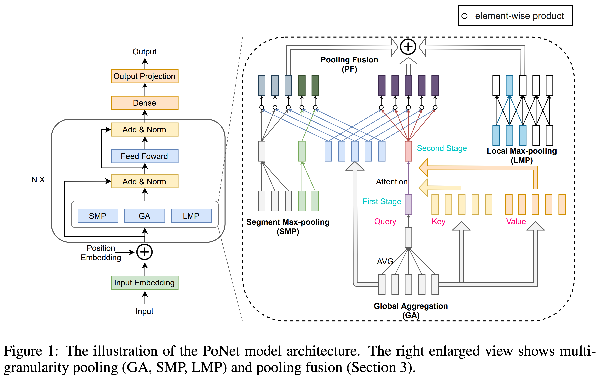
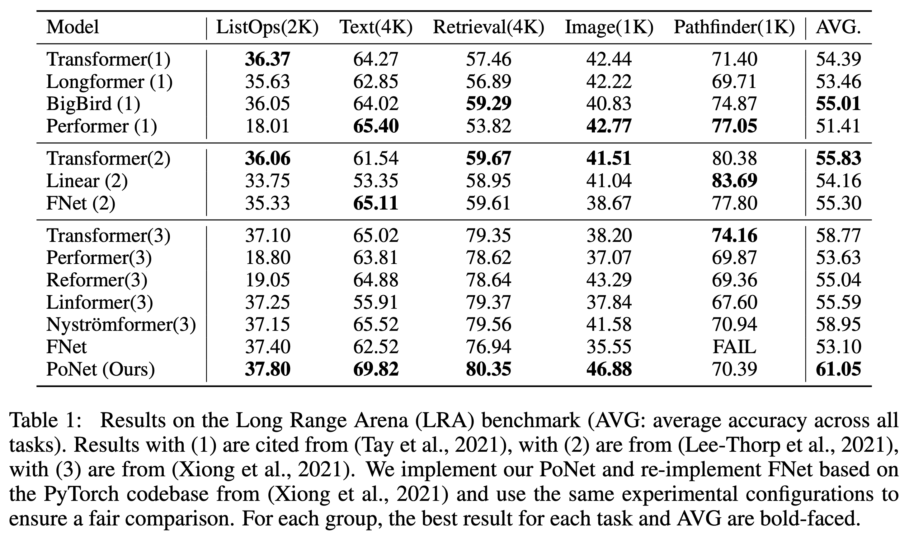
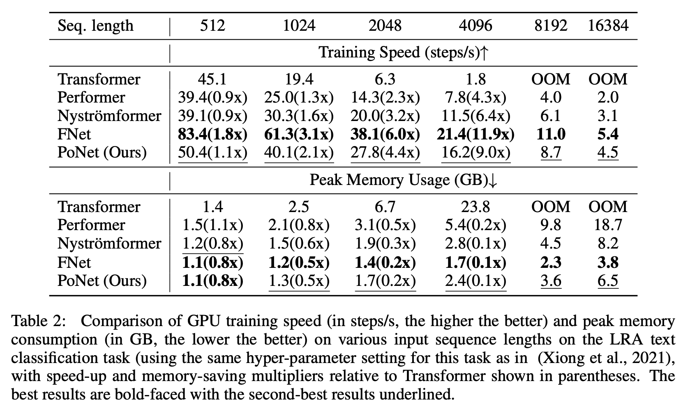

## Introduction

> This is a code repository for our paper ***[PoNet: Pooling Network for Efficient Token Mixing in Long Sequences](https://arxiv.org/abs/2110.02442)***. The full source code has been released.

Transformer-based models have achieved great success in various NLP, vision, and speech tasks. However, the core of Transformer, the self-attention mechanism, has a quadratic time and memory complexity with respect to the sequence length, which hinders applications of Transformer-based models to long sequences. Many approaches have been proposed to mitigate this problem, such as sparse attention mechanisms, low-rank matrix approximations and scalable kernels, and token mixing alternatives to self-attention. We propose a novel Pooling Network (PoNet) for token mixing in long sequences with linear complexity. We design multi-granularity pooling and pooling fusion to capture different levels of contextual information and combine their interactions with tokens. On the Long Range Arena benchmark, PoNet significantly outperforms Transformer and achieves competitive accuracy, while being only slightly slower than the fastest model, FNet, across all sequence lengths measured on GPUs. We also conduct systematic studies on the transfer learning capability of PoNet and observe that PoNet achieves 95.7% of the accuracy of BERT on the GLUE benchmark, outperforming FNet by 4.5% relative. Comprehensive ablation analysis demonstrates effectiveness of the designed multi-granularity pooling and pooling fusion for token mixing in long sequences and efficacy of the designed pre-training tasks for PoNet to learn transferable contextualized language representations.

<div align=center></div>

<div align=center></div>

<div align=center></div>

## Instruction

##### Python environment

The requirements package is in `requirements.txt`.

If you are using Nvidia's GPU and CUDA version supports 11.7, you can use the following code to create the desired virtual Python environment:

```shell
conda create -n ponet python=3.8
conda activate ponet
pip install -r requirements.txt
```

##### Special for Arxiv-11 Dataset

The data can be obtained from `https://github.com/LiqunW/Long-document-dataset`.

We also provided scripts to get it. Please refer to the shell file `run_shell/D1-arxiv11.sh`.

##### Run

For Pre-train, GLUE and Long-Text, please refer to the shell files under the `run_shell` folder.

For LRA, please refer to `examples/LRA/README.md`.

## Changelog

- [x] [2023.05.22] 
  - Source codes are submitted to ***[huggingface hub](https://huggingface.co/chtan/ponet-base-uncased)***. PoNet can now be used directly through the Transformers library.
  - Since the latest version of PyTorch supports `scatter_max` operations, we removed the third-party `pytorch-scatter` package and used the official functions instead.
  - Old codes are moved to ***[tag v1.0](https://github.com/lxchtan/PoNet/tree/v1.0)***.

- [x] [2022.07.20] Add a brief introduction to the paper in README.

- [x] [2022.07.09] The pretrained checkpoint is moved to GDrive.

- [x] [2022.07.09] Release the source code
  - [x] [2021.10.19] Pre-train Tasks 
  - [x] [2021.10.19] GLUE Tasks
  - [x] [2022.03.15] LRA Tasks
  - [x] [2022.07.09] Long-Text Tasks
- [x] [2021.10.19] Release the pretrained checkpoints

## Cite

```bibtex
@inproceedings{DBLP:conf/iclr/TanCWZZL22,
  author       = {Chao{-}Hong Tan and
                  Qian Chen and
                  Wen Wang and
                  Qinglin Zhang and
                  Siqi Zheng and
                  Zhen{-}Hua Ling},
  title        = {PoNet: Pooling Network for Efficient Token Mixing in Long Sequences},
  booktitle    = {The Tenth International Conference on Learning Representations, {ICLR}
                  2022, Virtual Event, April 25-29, 2022},
  publisher    = {OpenReview.net},
  year         = {2022},
  url          = {https://openreview.net/forum?id=9jInD9JjicF},
}
```